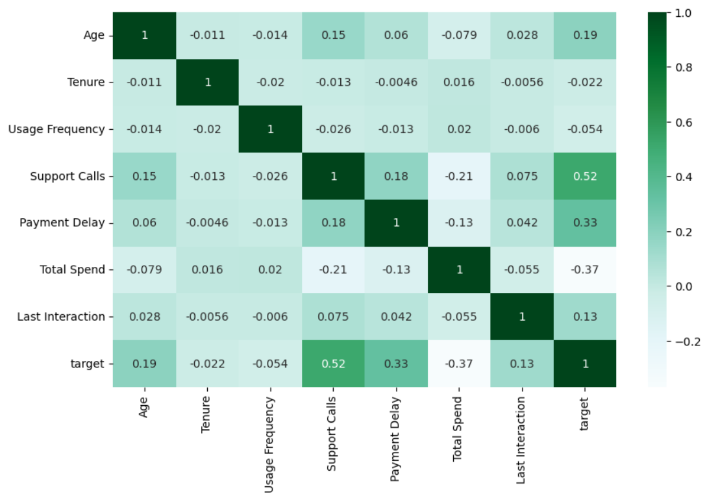
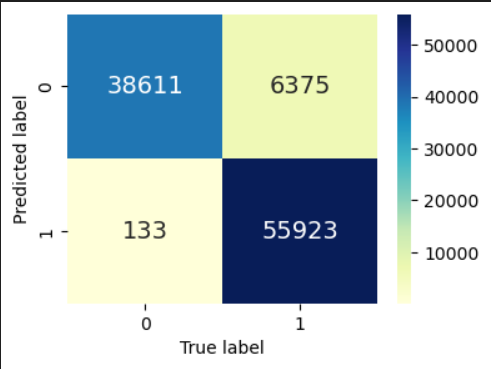

# Kaggle Community Olympiad: Customer Deflection 🏃

The objective of this project is to predict customer churn (deflection) based on historical customer data. Accurate predictions enable businesses to implement retention strategies and reduce revenue loss. The competition's evaluation metric was `log_loss`, which penalizes inaccurate probability estimates and ensures well-calibrated predictions.

---

## Visualizations

### Correlation Matrix  
Helps in identifying multicollinearity and relationships between features.  

### Confusion Matrix  
Illustrates the model’s performance across churn and non-churn classes.  

---

## Dataset
- Dataset: https://www.kaggle.com/competitions/kaggle-community-olympiad-customer-deflection/overview
- The dataset contains information about customer interactions, behavior, and transactions. All raw data is stored in the `data/` folder.  

---

## 🚀 Getting Started  

### 1. Clone the repository  
git clone https://github.com/YR-raj/Churn-Prediction.git

### 2. Go to project folder
cd Churn-Prediction

### 3. Create a virtual environment
conda create --name Churn_env python=3.9 -y

### 3. Activate environment
conda activate Churn_env

### 4. Install dependencies
conda env update --file environment.yml --prune

### 5. Run the notebook
jupyter notebook notebook.ipynb

---

## ⚙️ Tech Stack
- **Python**
- **Pandas, NumPy** (Data processing)
- **Matplotlib, Seaborn** (Visualization)
- **Scikit-learn** (Machine Learning)
- **Jupyter Notebook**

---

## 🚀 Steps in the Project
1. Data cleaning and preprocessing
2. **Exploratory Data Analysis**
3. Data Transformation
4. Feature Engineering
5. Model training using **Ensemble Methods**  
6. **Hyperparameter tuning** for improved performance  
7. Model evaluation with `log_loss` score 

---

## Approach
1. Feature Engineering: Created combined categorical features like `SubType_Contract`.
2. Categorical Encoding: Converted categorical features into numeric form using `LabelEncoder()` and then pandas' `CategoricalDtype`.
3. Modeling:
    - Used XGBClassifier from XGBoost.
    - Hyperparameters tuned for optimal log loss.
    - `Stratified K-Fold cross-validation` used for robust evaluation.
4. Evaluation: `Log_loss` calculated for validation folds to monitor performance.
5. Submission: Predicted probabilities on the test set and saved as a CSV file.

---

## Results
- Cross-validation Log Loss: `0.1858`
- Public Leaderboard Score: `0.1866`
- Public Leaderboard Rank: `5th`🥉

---

## Feature Importance
- Insights: Certain features like `Support_calls`, `Payment_delay`, and `Total_spend` have high importance in predicting target variable.

---

## 📈 Future Work
- Experiment with additional feature engineering.
- Try ensemble methods combining multiple models.
- Tune hyperparameters further to improve log loss.

---

## 🤝 Contributing
Pull requests are welcome. For major changes, please open an issue first to discuss what you would like to change.  

---

## License
Apache License
